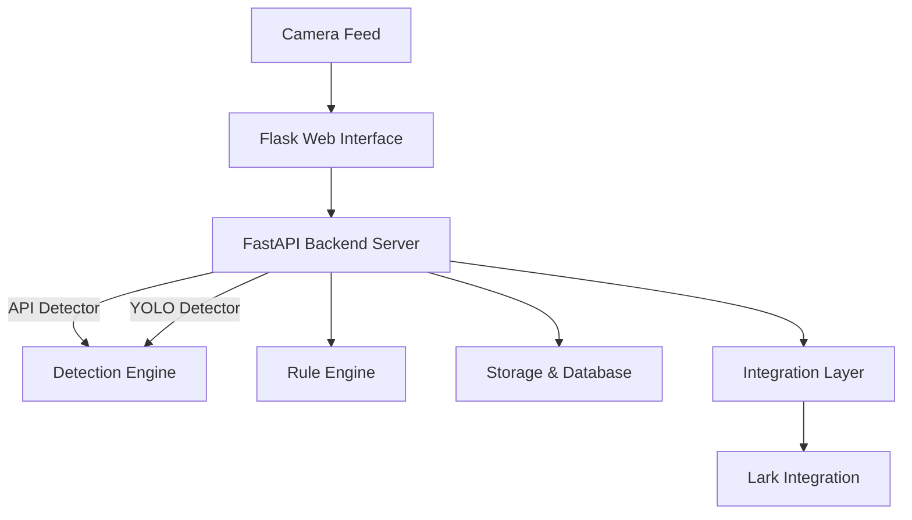

# 🍞 **SMARTBITES** - ERP Bread Quality Detector

<p align="center">
  
  
  
</p>

---

## 🥖 Bread Quality Inspection Platform

**SMARTBITES** is an AI-powered platform for real-time bread quality inspection, leveraging computer vision and deep learning. Seamlessly integrates with enterprise systems to automate quality assurance in food production.

---

## 🎯 Solution Overview

SMARTBITES automates bread quality inspection using two main approaches:

### 🚀 Approach 1: API-Based Detection (Production)
- External API endpoint for predictions
- Centralized AI service analyzes captured images
- Returns quality grades (good/bad) with confidence scores
- Supports distributed deployment

### 🖥️ Approach 2: Local YOLO Detection (Training & Offline)
- YOLOv8 model trained for bread quality
- On-device inference for edge scenarios
- Offline operation when API is unavailable
- Incremental model training with new data

### ⭐ Core Features
- Real-time camera feed inspection
- Automated grading (good/bad/defect)
- Rule-based decision engine
- Training data collection & fine-tuning
- Database persistence
- Web dashboard for monitoring & analytics

---

## 🏗️ System Architecture



---

## 🛠️ Technology Stack

| Layer         | Technology                                    |
|--------------|-----------------------------------------------|
| Backend      | FastAPI, Flask, Python 3.8+                   |
| AI/CV        | YOLOv8, OpenCV, ONNX Runtime, NumPy, PyTorch  |
| Data         | PostgreSQL, Pydantic, PyYAML                  |
| Frontend     | Jinja2, HTML5/CSS3, JavaScript                |
| Integrations | Requests, Python-multipart, Python-dotenv      |

---

## 🔌 Enterprise Integrations

### 📨 Lark (Feishu) Integration
- **Purpose**: Instant notifications & collaboration
- **Implementation**: `app/integrations/lark.py`
- **Features**:
  - Webhook notifications
  - Bitable (database) integration
  - Quality alerts with detection images
  - Tenant access token management
  - Configurable notification templates

---

## 📋 Prerequisites

- Python 3.8 or higher
- Webcam or compatible camera
- Windows/Linux/macOS
- 4GB+ RAM recommended
- GPU optional (for faster YOLO training)

---

## 🚀 Getting Started

### 1️⃣ Clone the Repository
```bash
git clone https://github.com/tbsiAndrew/erp-food-qa.git
cd erp-food-qa
```

### 2️⃣ Create Virtual Environment
```bash
python -m venv .venv
.venv\Scripts\activate  # Windows
# or
source .venv/bin/activate  # Linux/Mac
```

### 3️⃣ Install Dependencies
```bash
pip install -r requirements.txt
```

### 4️⃣ Configure Environment
Create a `.env` file in the project root:
```env

# API endpoint for bread quality detection
API_ENDPOINT=https://your-api-endpoint.com/

# Camera identifier (e.g., CAM01)
CAMERA_ID=CAM01

# Path for storing images locally
LOCAL_STORAGE_PATH=storage/images

# Path for local SQLite database file
DATABASE_PATH=storage/qa_database.db

# ============================================================
# OPTIONAL INTEGRATIONS (Disabled by default)
# ============================================================

# Lark (Feishu) integration - Set LARK_ENABLED=true to enable
LARK_ENABLED=false            # true to enable Lark integration
LARK_APP_SECRET=your_app_secret   # Lark application secret
LARK_APP_ID=your_app_id       # Lark application ID
LARK_DRIVE_FOLDER_TOKEN=your_folder_token   # Lark Drive folder token

# Anycross File Upload (optional - for attaching images to Lark Base)
LARK_WEBHOOK_URL=https://open.feishu.cn/open-apis/bot/v2/hook/your-webhook
ANYCROSS_CREATE_FILE_URL=https://your-anycross-url.com   # Anycross file upload URL
LARK_BASE_ID=your_base_id       # Lark Base ID
LARK_TABLE_ID=your_table_id     # Lark Table ID
LARK_FIELD_ID=your_field_id     # Lark Field ID
ANYCROSS_ACCESS_TOKEN=your_anycross_access_token   # Anycross access token
LARK_TENANT_ACCESS_TOKEN=your_lark_tenant_access_token   # Lark tenant access token
```

### 5️⃣ Run the Application

**Quick Start (Windows):**
```bash
START_LOCAL.bat
```

**Manual Start:**
```bash
uvicorn app.main:app --host 0.0.0.0 --port 8000
python web/app.py
```

### 6️⃣ Access the Application
- Web Interface: http://127.0.0.1:5555
- API Docs: http://127.0.0.1:8000/docs
- Training: http://127.0.0.1:5555/train

---

## 📸 Usage

### 🥯 Quality Inspection
1. Open http://127.0.0.1:5555
2. Select camera
3. Start live feed
4. Position bread item
5. Capture & Inspect
6. Review results

### 🧑‍🔬 Model Training
1. Go to /train
2. Capture training images
3. Label images
4. Submit for training

### 🔗 API Endpoints
- `POST /inspect` - Analyze image
- `POST /train` - Submit training data
- `GET /results` - Inspection history
- `GET /dashboard` - Analytics dashboard

---

## 📁 Project Structure

```text
erp-food-qa/
├── app/                      # FastAPI backend
│   ├── main.py               # Main API server
│   ├── config.py             # Configuration
│   ├── models.py             # Data models
│   ├── db.py                 # Database ops
│   ├── storage.py            # File storage
│   ├── rules.py              # Rule engine
│   ├── dashboard.py          # Analytics
│   ├── detectors/            # Detection
│   │   ├── api_detector.py   # API integration
│   │   ├── yolo_detector.py  # YOLO wrapper
│   │   └── onnx_yolo.py      # ONNX engine
│   ├── integrations/         # Integrations
│   │   └── lark.py           # Lark/Feishu
│   └── sql/                  # DB migrations
├── web/                      # Flask web
│   ├── app.py                # Web server
│   └── templates/            # HTML
├── dataset/                  # Training data
│   └── bread_qa_auto_labeled/
├── models/                   # Pre-trained models
├── rules/                    # Quality rules
│   └── default.yaml
├── runs/                     # Training outputs
├── storage/                  # Local storage
├── requirements.txt          # Dependencies
└── README.md                 # This file
```

---

## 🎓 Training Your Own Model

### 📷 Collect Training Data
```bash
python app/incremental_train.py
```

### 🏋️‍♂️ Start Training
```bash
START_TRAINING.bat
# or
python -m ultralytics train \
  --data dataset/bread_qa_auto_labeled/data.yaml \
  --model yolov8n.pt \
  --epochs 100 \
  --imgsz 640
```

### 🔄 Incremental Training
```bash
RUN_INCREMENTAL_TRAINING.bat
```

---

## 🔧 Configuration

### 📝 Quality Rules (`rules/default.yaml`)
```yaml
pass_criteria:
  min_confidence: 0.7
  allowed_defects: []
grade_mapping:
  good: A
  bad: C
  unknown: F
notification_threshold: 0.5
```

### 🗄️ Database Schema
- `qa_results` - Inspection records
- `training_data` - Labeled images
- `erp_events` - Integration logs

---

## 🤝 Contributing

1. Fork the repository
2. Create a feature branch (`git checkout -b feature/YourFeature`)
3. Commit changes (`git commit -m 'Add YourFeature'`)
4. Push to branch (`git push origin feature/YourFeature`)
5. Open a Pull Request

---

## 📄 License

MIT License - see LICENSE file for details.

---

## 👥 Authors

- **Andrew** - *Initial work* - [tbsiAndrew](https://github.com/tbsiAndrew)

---

## 🙏 Acknowledgments

- Ultralytics for YOLOv8
- FastAPI for API framework
- OpenCV community
- DIREC AMPLIFAI

---

<p align="center"><b>Built with ❤️ for automated food quality assurance</b></p>
